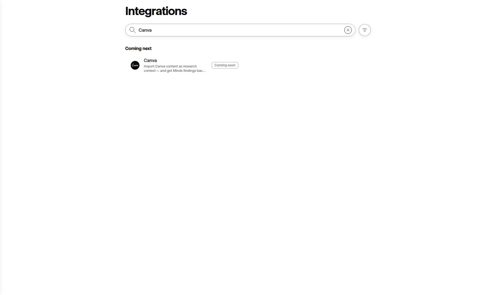
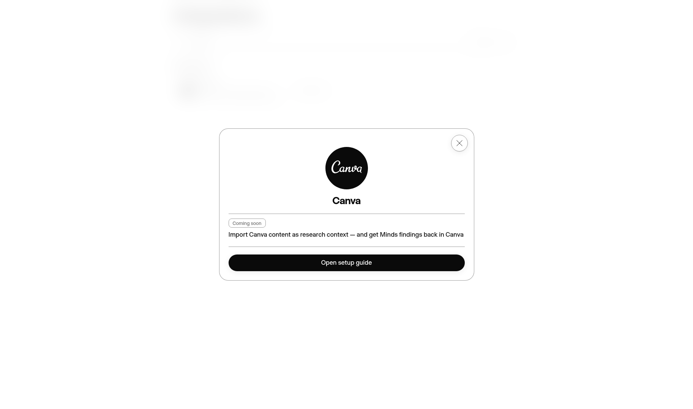

# Creative integration production QA — 30 September 2026

The documentation and Integrations-tab release is deployed as `64856529cd7dd1ca87f7fa576885ea200345fc41` through [webapp #7992](https://github.com/minds-ai-co/webapp/pull/7992). The [canonical production deployment](https://github.com/minds-ai-co/webapp/actions/runs/36776162319) passed rollout, post-deploy smoke and asset verification. The review-only admin merge was explicitly owner-approved; every required technical gate and production image prebuild passed.

## Native browser acceptance

Five authenticated card → Coming soon modal → public setup-guide flows passed: Canva, Figma · Minds Creative Review, Adobe Express, Adobe GenStudio and Zapier. Each detail exposed exactly one guide action and no OAuth action. The existing Figma account card remained separate and retained its OAuth action; it was inspected without connecting or disconnecting. Connected filtering excluded the planned Canva card. No connector POST/PUT/PATCH/DELETE requests were triggered by the documentation flow. The Canva guide also passed a mobile-width overflow check.

[ui-e2e.json](ui-e2e.json) records the acceptance checks. These verify documentation discoverability and status presentation. Provider installation, research draft confirmation/execution and marketplace readiness retain the separate gates in [OPERATIONS.md](../../OPERATIONS.md) and [LAUNCH.md](../../LAUNCH.md).

## Live content acceptance

All 45 authored guide pages (five guides across nine locales) returned HTTP 200 and rendered their frontmatter title, exact canonical URL and noindex. Both original provider-evidence PNG assets matched their recorded SHA-256 values. Desktop/mobile browser checks, including German and Arabic, confirmed successful image decoding and no horizontal overflow. See [guide-e2e.json](guide-e2e.json) and [guide-browser-e2e.json](guide-browser-e2e.json).

E2E found an asset-routing fault: screenshot URLs initially returned webapp HTML. [Content #382](https://github.com/minds-ai-co/minds-content/pull/382) added the exact content-owned image prefix, IPX handling and deployed route. All 47 router contracts passed, then the public hash and browser decoding checks passed after the canonical Worker deployment.

## Sanitized native screenshots

The screenshots are crops of the real authenticated production UI, with fonts ready and animations disabled. They exclude account chrome, private research, customer identifiers and credentials. [manifest.json](manifest.json) records capture provenance, dimensions and SHA-256 hashes. Both files were visually inspected.

