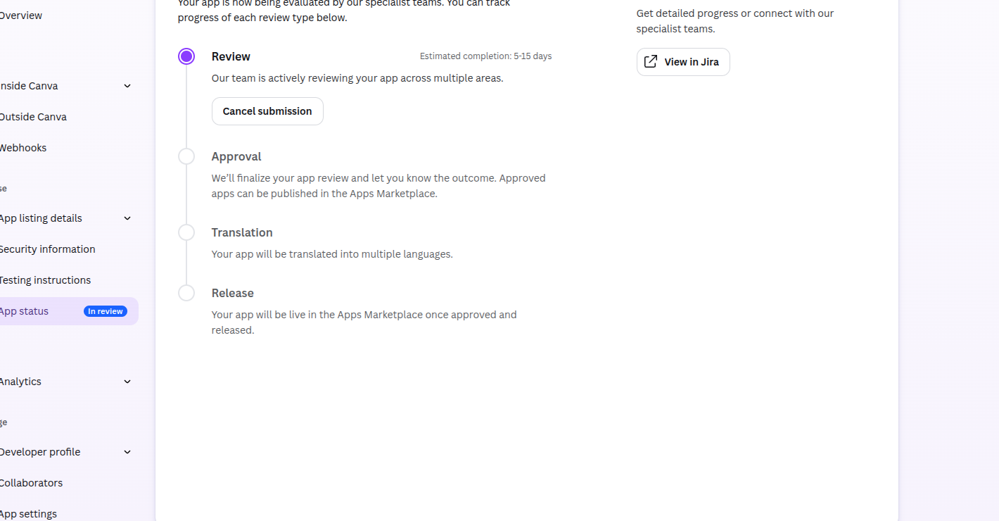
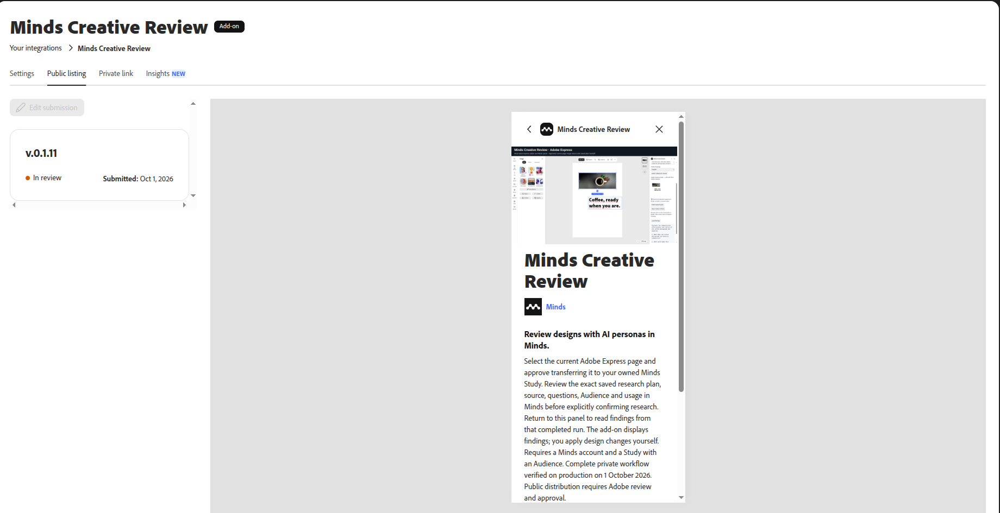

# Production creative workflow acceptance — 1 October 2026

Production webapp PR [8030](https://github.com/minds-ai-co/webapp/pull/8030) deployed successfully. Canva and Adobe Express were exercised in their actual native hosts against production: export, explicit material-transfer consent, authenticated source upload, saved plan, exact-draft review, Audience and usage review, explicit execution confirmation, completed run, and exact findings returned to the original panel. Reload resumed each confirmed run without resubmission. Canva inserted those findings through its native SDK after an explicit click. Express displays them without insertion.

The fixture was an owned synthetic headline design and a 20-Mind Audience, with one executed question per run. This verifies the customer integration workflow, not empirical validity of the synthetic findings. See `acceptance.json` for exact deployment, run receipts and image hashes.

Screenshots are genuine native browser captures. The Minds screenshots are lossless pixel-identical crops of the original 1920×1080 capture, excluding unrelated sidebar/account details. Host findings panels are native viewport clips. No credential, signed source link, private installation claim link or session export is included.

Zapier 1.2.0 separately passed real hosted authentication, owned Study creation, saved-plan preview, and empty results before confirmation. It has not passed a complete native Zap editor run. Figma Review still needs a genuine Desktop plugin ID and native host acceptance; the existing Figma import is a different integration. GenStudio requires an entitled Adobe organization. Public marketplace approval remains separate for all candidates.

## Native photograph captures and isolated reviewers

The additional `canva-native-image-workflow.png` and `express-native-image-workflow.png` show real editor canvases, native stock coffee photographs and the Minds panels together. Canva exports only page 2 as PDF; Express exports its approved current page as PNG. Both transferred to separate reviewer-owned Studies and prepared saved drafts. The account toolbars are excluded. `native-image-captures.json` records dimensions and hashes. These captures demonstrate image source and draft preparation, not completed image research; the earlier completed headline fixtures remain separate.

Two dedicated plus-address reviewer accounts were created through the production signup, confirmed through their actual email links and verified by native login. Each has a private owned Study with a public 20-Mind Audience. Both passed native host OAuth and can select only accessible Studies. The owner explicitly authorized the credits needed for public review. Each account received an audited 100-credit manual grant. Native execution then exposed a separate free-plan gate, so the canonical company-knowledge grant tool provisioned 31-day Individual reviewer trials with a 100-response monthly override. Both trials expire on 1 November 2026, have no payment method and cancel at expiry if none is added. Stripe and the production entitlement cache were verified; subscription plans were not fabricated through database writes.

Canva accepted a private company registration extract whose entity, register and registered address matched the existing public company details. Its encrypted reviewer credential fields persisted across reload. Developer declarations need native blur and must be checked again after reload before submission. Version 1 was submitted and received one initial listing issue: remove the full stop from the one-sentence short description. Version 2 copies the app and metadata, uses “Review designs with AI personas in Minds” and was resubmitted. The native portal confirms receipt and In review status; public release still requires approval and release.

Adobe’s over-length keywords were corrected. Its Notes to reviewer is required despite the Spectrum host marking `required:false`; the provider documents this as its testing-credential channel. Credentials are supplied only from the dedicated encrypted vault at runtime. Those notes do not persist with Save draft and exit, so re-enter them immediately before a valid submission, without screenshots or logs. The public 0.1.11 listing was submitted after completed image research. The native provider confirms “You successfully submitted a public add-on listing!” and In review; editing is locked during review.

Figma’s installed Mac mini Desktop app still needs genuine plugin registration; an actual ApplicationServices read returned accessibility trust false. No permission boundary was bypassed. GenStudio still needs an entitled Adobe organization. Zapier still needs two additional genuine users with live Zaps; plus-address accounts were not used to manufacture public qualification.

## Completed image research and public submissions

| Platform | Reviewer image run | Native public submission | Remaining release step |
| --- | --- | --- | --- |
| Canva | `36187888-b031-4ece-ad44-2c03e59c4f3b`: 1 question × 20 Minds, completed 100%, zero failed/partial artifacts | Version 2, In review; version 1 short-description punctuation feedback corrected | Canva review, approval and marketplace release |
| Adobe Express | `fee878a1-ab0a-44f8-bbd7-3c652a30e72a`: 2 questions × 20 Minds, completed 100%, zero failed/partial artifacts | Public package 0.1.11, successful public-listing receipt, In review | Adobe review and publication |

`reviewer-release-acceptance.json` records the exact owned Studies, drafts/runs, audited credit scope, verified temporary trials and remaining balances (Canva 180; Express 160). The photograph capture manifest remains a record of the earlier source/draft stage; it is not retroactively presented as a results screenshot. The public submission JSON receipts contain no testing passwords. Canva’s initial receipt and feedback are retained separately from the corrected current submission. All 18 Canva/Express localized guides and both versioned image hashes were checked live after successful production promotion.

Figma still needs its genuine desktop-generated plugin ID and native host acceptance; GenStudio still needs an entitled Adobe organization; Zapier still needs genuine public-qualification users. Dedicated aliases are not used to manufacture Zapier usage. No public install links or marketplace approval are claimed.

## Native submission and completed-results screenshots

The six current captures and their dimensions, clip coordinates, SHA-256 hashes and visual checks are recorded in [reviewer-release-captures.json](reviewer-release-captures.json). They contain native page pixels, with account headers excluded. Completed-plan screenshots retain the cached pre-run usage display; the independently checked current balances are in the acceptance JSON.

Completed image execution: [Canva](canva-reviewer-image-completed.png), [Adobe Express](express-reviewer-image-completed.png). Native “View results in Study” opened the owning Studies and rendered their completed findings: [Canva Study results](canva-reviewer-study-results.png), [Adobe Express Study results](express-reviewer-study-results.png). These are synthetic QA fixtures, not marketplace approval or customer performance evidence.

## Figma MacBook registration and live gateway

The Mac mini is retired. The replacement MacBook generated genuine plugin ID `1687580744489834770` and rendered the built Minds Creative Review panel. Native origin `null` was verified and enabled after the explicit capability/OAuth security review. [The production deployment receipt](figma-gateway-deployment.json) records the exact Node source/deployment, Worker version, health and isolation checks for Figma, Canva and Express. [The native registration receipt](figma-macbook-registration-progress.json) records registration separately from end-to-end acceptance.

The MacBook reached its lock screen before native OAuth and selected-image execution could be completed. Screen capture and Accessibility grants are already verified. Native complete-workflow screenshots and a public Community submission remain pending; no older blank-canvas capture is represented as acceptance evidence.
